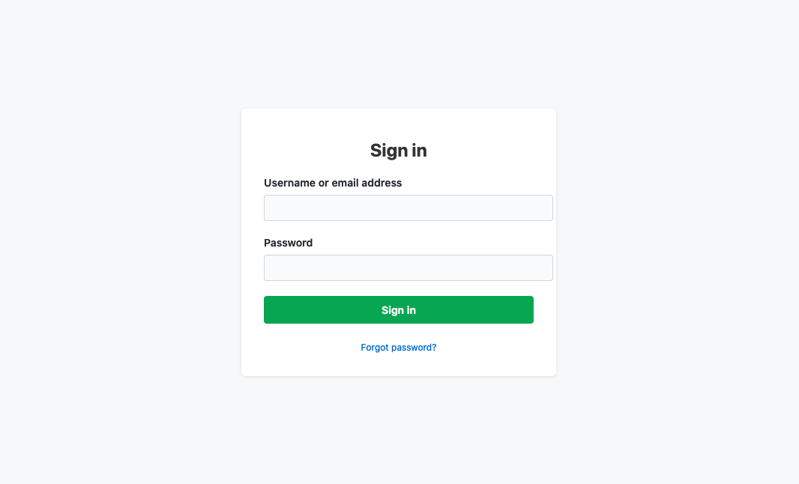

Certainly! Here's how you can include a screenshot in your `README.md` file for your GitHub project:

---

# GitHub-Style Login Page

A simple login page inspired by GitHub's design, implemented with PHP and HTML/CSS.

## Screenshots


--- 

## Project Structure

```plaintext
.
├── index.html              # The main HTML file containing the login form
├── login.php               # PHP script to handle user authentication
└── screenshots
    └── 1.png               # Screenshot of the login page
```

## Features

- **Responsive Design**: The login page is responsive and adjusts to different screen sizes.
- **User Authentication**: Basic authentication using PHP, validating the username and password against a MySQL database.
- **Security**: Passwords are hashed using `password_hash()` and verified using `password_verify()`.

## Setup

### Prerequisites

- **Web Server**: Apache, Nginx, or any other web server with PHP support.
- **PHP**: Version 7.4 or higher.
- **MySQL**: A MySQL database to store user credentials.

### Installation

1. **Clone the Repository**:
   ```bash
   git clone https://github.com/soheil-vanaee/github-style-login-php.git
   ```

2. **Set Up the Database**:
   - Create a MySQL database and a table `userslogin` with the following structure:

     ```sql
     CREATE TABLE `userslogin` (
       `id` int(11) NOT NULL AUTO_INCREMENT,
       `username` varchar(50) NOT NULL,
       `password` varchar(255) NOT NULL,
       `reg_date` datetime NOT NULL,
       PRIMARY KEY (`id`)
     );
     ```

   - Insert a sample user (replace with your own values):

     ```sql
     INSERT INTO `userslogin` (`username`, `password`, `reg_date`) 
     VALUES ('soheil', '$2y$10$lZWR5OrWrfiVC3F.rGE1Qui4ozjPEavC13BFC7cYgQSGt.qdFyQo6', NOW());
     ```

3. **Configure the Database Connection**:
   - Edit the `database.php` (you should create this file if it doesn’t exist) to include your database connection details:

     ```php
     <?php
     $servername = "localhost";
     $username = "your_db_username";
     $password = "your_db_password";
     $dbname = "your_database";

     // Create connection
     $conn = new mysqli($servername, $username, $password, $dbname);

     // Check connection
     if ($conn->connect_error) {
         die("Connection failed: " . $conn->connect_error);
     }
     ?>
     ```

4. **Run the Project**:
   - Place the project files in your web server’s root directory.
   - Access the login page via your web browser, typically at `http://localhost/index.html`.

## Usage

- **Login Page**: Enter your username and password. If the credentials are correct, you'll receive a success message. Otherwise, you'll see an error.
---

README.md file created by artificial intelligence chatGPT :) 
